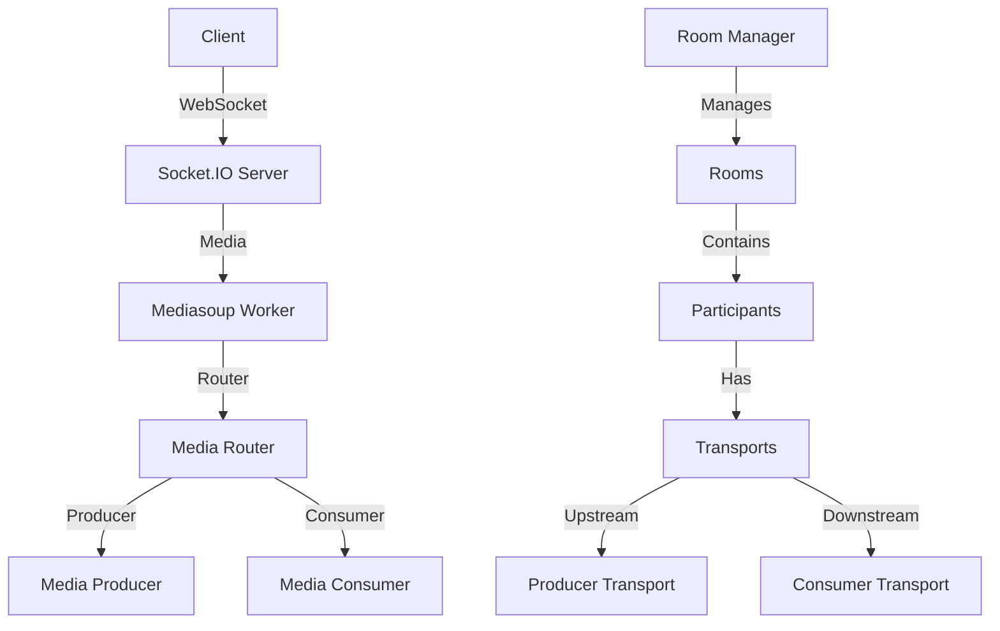

# Video Conferencing Application with Mediasoup

A real-time video conferencing application built with Mediasoup, Socket.IO, and WebRTC. This application supports multiple participants in a room with audio/video streaming, active speaker detection, and dynamic media routing.

## Architecture Overview

### System Components



### Core Components

1. **Mediasoup Workers**

   - Manages media processing and routing
   - Handles WebRTC transport
   - Supports multiple codecs (Opus for audio, H264/VP8 for video)
   - Configurable ports and logging

2. **Room Management**

   - Dynamic room creation and management
   - Participant tracking
   - Active speaker detection
   - Media router per room

3. **Participant Management**

   - User identification
   - Transport management
   - Producer/Consumer handling
   - Socket connection management

4. **Media Handling**
   - Audio/Video streaming
   - Active speaker detection
   - Dynamic media routing
   - Transport negotiation

## Technical Details

### Media Configuration

```javascript
// Supported Codecs
- Audio: Opus (48kHz, 2 channels)
- Video: H264 and VP8
```

### Transport Configuration

```javascript
// WebRTC Transport Settings
- Max Incoming Bitrate: 5Mbps
- Initial Available Outgoing Bitrate: 5Mbps
- Port Range: 40000-41000
```

### Socket Events

1. **Room Management**

   - `join-room`: Join/create a room
   - `disconnect`: Handle participant disconnection
   - `hangUp`: Graceful room exit

2. **Transport Management**

   - `requestTransport`: Request new transport
   - `connectTransport`: Connect transport with DTLS parameters

3. **Media Handling**

   - `startProducing`: Start media production
   - `consumeMedia`: Consume media from other participants
   - `unpauseConsumer`: Resume media consumption

4. **Speaker Management**
   - `updateSpeakers`: Update active speaker list
   - `newProducersToConsume`: Notify about new media producers

## Setup and Installation

1. Install dependencies:

```bash
npm install
```

2. Configure environment:

   - Update `config.js` with your network settings
   - Set appropriate port ranges
   - Configure media codecs if needed

3. Start the server:

```bash
node server.js
```

## Features

- Real-time video/audio streaming
- Dynamic room creation and management
- Active speaker detection
- Automatic media routing
- Multiple codec support
- Scalable worker architecture
- WebRTC transport optimization

## Dependencies

- mediasoup: ^3.15.2
- socket.io: ^4.8.1
- express: ^4.21.2
- redis: ^5.0.1

## Security Considerations

- DTLS encryption for media
- WebRTC security features
- Transport authentication
- Room access control

## Performance Optimization

- Worker-based architecture
- Dynamic bitrate control
- Efficient media routing
- Active speaker optimization
- Transport pooling

## Error Handling

- Graceful worker failure handling
- Transport error recovery
- Room cleanup on participant exit
- Connection state management

## Future Improvements

- Recording capabilities
- Screen sharing
- Chat functionality
- Bandwidth adaptation
- Network quality monitoring
