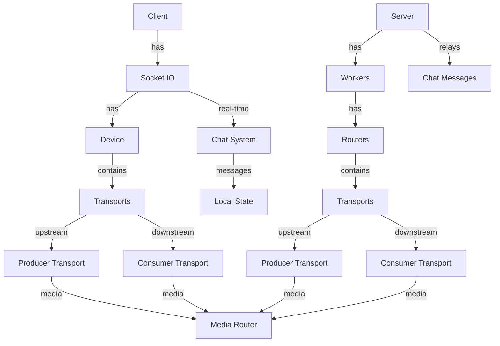

# Muxo -> Video Conferencing Application with Mediasoup & Real-time Chat

A real-time video conferencing application built with Mediasoup, Socket.IO, and WebRTC. This application supports multiple participants in a room with audio/video streaming, active speaker detection, dynamic media routing, and **real-time chat functionality**.

## Video


https://github.com/user-attachments/assets/82cc5a34-c11e-4a49-b584-67afb3e4d81c


## 🆕 New Features

### Real-time Chat System

- **Live Chat**: Real-time messaging during video conferences
- **Role-based Permissions**:
  - Viewers can send and receive messages
  - Streamers can view messages but cannot send (focus on streaming)
- **Clean UI**: Beautiful glassmorphism chat interface matching the app theme
- **Message Management**: Messages stored locally (not persisted on server)
- **Minimizable Chat**: Floating chat icon in bottom-left corner
- **Auto-scroll**: New messages automatically scroll into view
- **User Names**: Display actual participant names in chat

### Enhanced User Experience

- **Name-based Identity**: Users enter their names when joining rooms
- **Position Optimized**: Chat positioned in bottom-left for better UX
- **Real-time Sync**: Instant message delivery via Socket.IO
- **Message Counter**: Unread message notifications when minimized

## Architecture Overview

### System Components



### Core Components

1. **Mediasoup Workers**

   - Manages media processing and routing
   - Handles WebRTC transport
   - Supports multiple codecs (Opus for audio, H264/VP8 for video)
   - Configurable ports and logging

2. **Room Management**

   - Dynamic room creation and management
   - Participant tracking
   - Active speaker detection
   - Media router per room
   - **Chat room isolation**: Messages only sent to participants in same room

3. **Participant Management**

   - User identification with custom names
   - Transport management
   - Producer/Consumer handling
   - Socket connection management
   - **Role-based permissions**: Streamer vs Viewer capabilities

4. **Real-time Chat System** 🆕

   - Socket.IO message relay
   - Role-based messaging permissions
   - Local message storage (not persisted)
   - Real-time message synchronization
   - Clean, minimizable UI interface

5. **Media Handling**
   - Audio/Video streaming
   - Active speaker detection
   - Dynamic media routing
   - Transport negotiation

## Technical Details

### Media Configuration

```javascript
// Supported Codecs
- Audio: Opus (48kHz, 2 channels)
- Video: H264 and VP8
```

### Transport Configuration

```javascript
// WebRTC Transport Settings
- Max Incoming Bitrate: 5Mbps
- Initial Available Outgoing Bitrate: 5Mbps
- Port Range: 40000-41000
```

### Socket Events

1. **Room Management**

   - `join`: Join/create a room
   - `disconnect`: Handle participant disconnection
   - `hangUp`: Graceful room exit

2. **Transport Management**

   - `request-transport`: Request new transport
   - `connect-transport`: Connect transport with DTLS parameters

3. **Media Handling**

   - `produce`: Start media production
   - `consume`: Consume media from other participants
   - `unpause`: Resume media consumption

4. **Speaker Management**

   - `updateSpeakers`: Update active speaker list
   - `newProducersToConsume`: Notify about new media producers

5. **Chat System** 🆕
   - `chatMessage`: Send/receive chat messages
   - Room-based message relay
   - Real-time message broadcasting

## Setup and Installation

1. **Install dependencies:**

```bash
# Server
cd server
npm install

# Client
cd client
npm install
```

2. **Configure environment:**

   - Update `config.js` with your network settings
   - Set appropriate port ranges
   - Configure media codecs if needed

3. **Start the application:**

```bash
# Start server (Terminal 1)
cd server
npm start

# Start client (Terminal 2)
cd client
npm run dev
```

4. **Access the application:**
   - Open browser to `http://localhost:5173`
   - Enter your name and room name
   - Choose "Join as Streamer" or "Join as Viewer"

## Features

### Core Video Conferencing

- Real-time video/audio streaming
- Dynamic room creation and management
- Active speaker detection
- Automatic media routing
- Multiple codec support
- Scalable worker architecture
- WebRTC transport optimization

### 🆕 Chat & Communication

- **Real-time messaging** during video calls
- **Role-based permissions**: Viewers can chat, streamers view-only
- **Beautiful UI**: Glassmorphism design matching app theme
- **Smart positioning**: Bottom-left placement for optimal UX
- **Minimizable interface** with message counters
- **Auto-scroll** for new messages
- **Name-based identity** in chat

### User Experience

- Clean, modern interface with gradient themes
- Responsive design for all screen sizes
- Smooth animations and transitions
- Intuitive controls and navigation

## Chat System Usage

### For Streamers:

1. Join room as "Streamer"
2. View incoming chat messages from viewers
3. Focus on streaming without chat distractions

### For Viewers:

1. Join room as "Viewer"
2. Send messages to engage with the stream
3. See messages from other viewers in real-time
4. Minimize/maximize chat as needed

### Chat Features:

- Messages display with sender name and timestamp
- 200 character limit per message
- Real-time delivery to all room participants
- Messages not saved on server (privacy-focused)
- Clean, readable message bubbles

## Dependencies

### Server

- mediasoup: ^3.15.2
- socket.io: ^4.8.1
- express: ^4.21.2

### Client

- React 18
- Vite
- Socket.IO Client
- Tailwind CSS
- Mediasoup Client

## Security Considerations

- DTLS encryption for media
- WebRTC security features
- Transport authentication
- Room access control
- **Chat isolation**: Messages only within room boundaries
- **No message persistence**: Privacy-focused chat system

## Performance Optimization

- Worker-based architecture
- Dynamic bitrate control
- Efficient media routing
- Active speaker optimization
- Transport pooling
- **Lightweight chat**: Local state management for fast UI

## Error Handling

- Graceful worker failure handling
- Transport error recovery
- Room cleanup on participant exit
- Connection state management
- **Chat connectivity**: Automatic reconnection for messages

## Troubleshooting

### Common Issues:

1. **Chat messages not appearing**: Check browser console for socket connection errors
2. **Video not working**: Ensure camera/microphone permissions are granted
3. **Connection issues**: Verify server is running on correct port (3030)

### Browser Support:

- Chrome 90+ (Recommended)
- Firefox 88+
- Safari 14+
- Edge 90+
